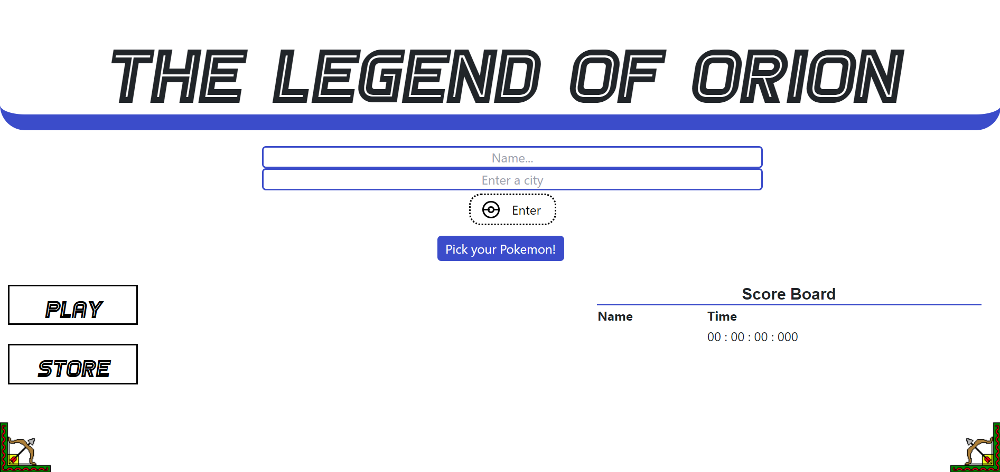

# react-portfolio

## Description
Hello, I would like to properly introduce myself. My name is Josue Paniagua, but you can call me Joshua. As a personal project, I decided to make a professional portfolio.

## Table of Contents

- [Installation](#installation)
- [Usage](#usage)
- [Credits](#credits)
- [License](#license)

## Installation

Steps to follow to install My Portfolio project:
1. Go to Gitbash and select a folder to store the project
2. Use the git clone command to clone the repo
3. Use Visual Studio to open the folder and access the project
4. Final step, enjoy the project

## Usage

## Credits

Old Portfolio: https://github.com/josuepaniagua/Josue-s-Professional-Portfolio 
## License

For this project, I did not use a license.
